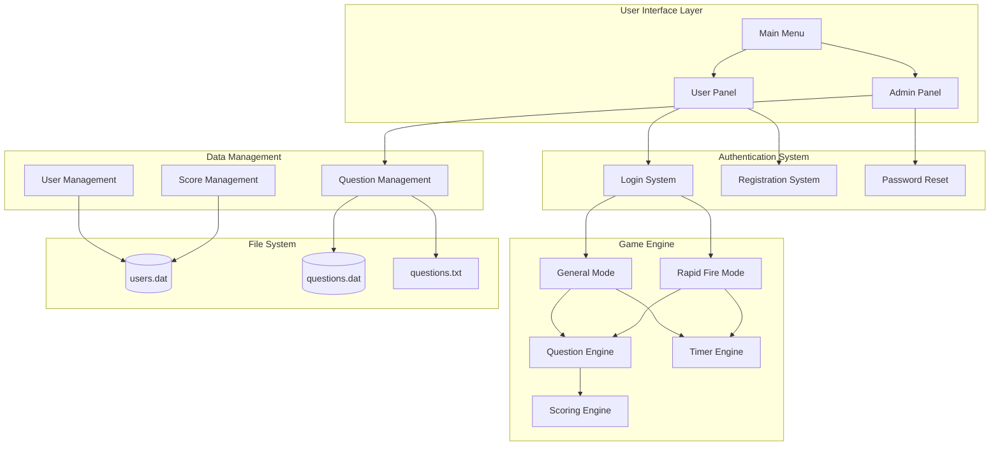
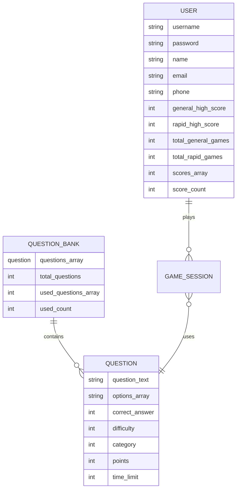
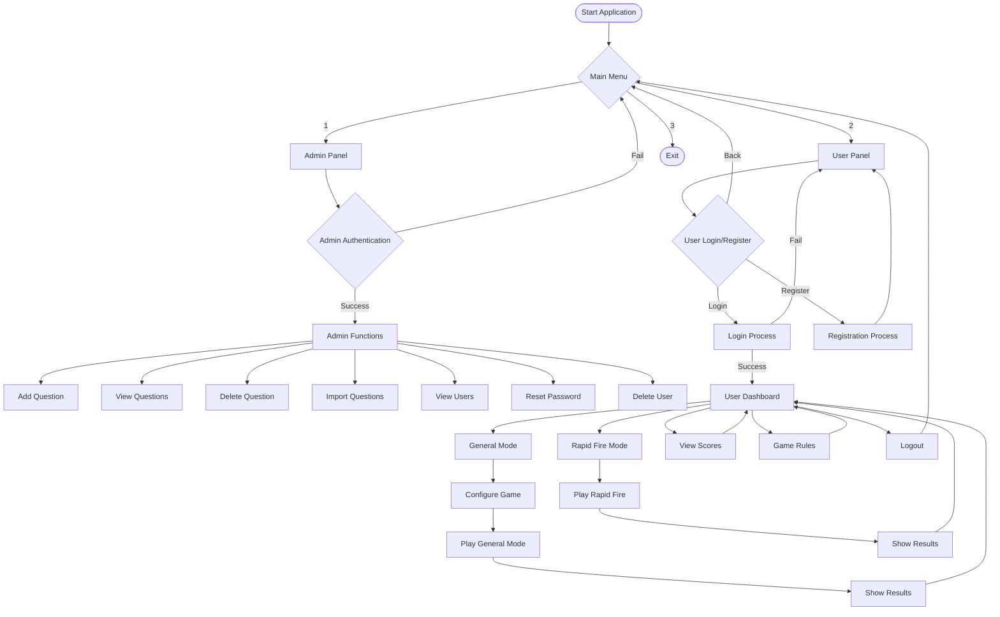
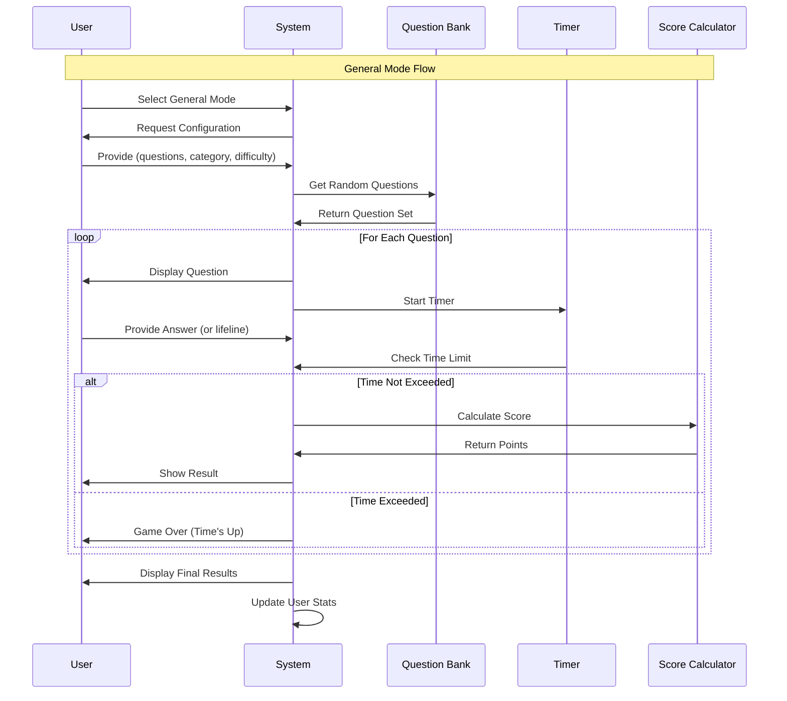
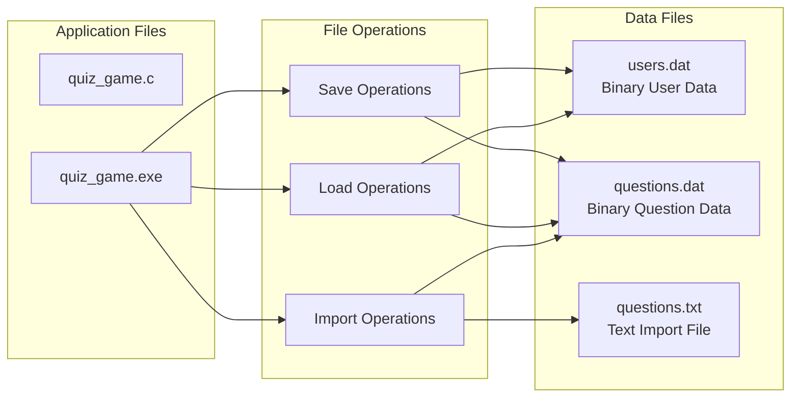
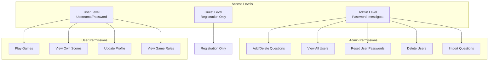

# Quiz Game System Design

## Overview
This is a comprehensive C-based quiz game system with user management, question banking, and multiple game modes. The system provides both administrative and user interfaces with persistent data storage.

## System Architecture Diagram

## Data Structure Design

## User Flow Diagram

## Game Mode Flow

## File System Architecture

## Security & Access Control

## Key Features

### User Management
- User registration with validation
- Secure login system
- Password reset functionality (admin only)
- User profile management
- Score tracking and history

### Question Management
- Multiple categories (General Knowledge, Geography-Nepal, Science, Sports, Programming)
- Three difficulty levels (Easy, Medium, Hard)
- Dynamic question import from text files
- Question CRUD operations (admin only)

### Game Modes
1. **General Mode**
   - Configurable number of questions (1-50)
   - Category and difficulty selection
   - Time limits based on difficulty
   - 50-50 lifeline feature
   - Points system based on difficulty

2. **Rapid Fire Mode**
   - 60-second time limit
   - Medium difficulty questions
   - Mixed categories
   - Rapid scoring system
   - Wrong answer review

### Data Persistence
- Binary file storage for performance
- Automatic backup and recovery
- Import/export capabilities
- Score history tracking

## Technical Specifications

- **Language**: C
- **Data Storage**: Binary files (.dat) and text files (.txt)
- **Memory Management**: Static arrays with defined limits
- **Timer System**: System time-based timing
- **Random Generation**: Seeded random number generation
- **Cross-platform**: Compatible with Windows and Unix systems

## Contact Information
- **SMS/WhatsApp**: +977-9866348028
- **Email**: dhakalsaurab1234@gmail.com