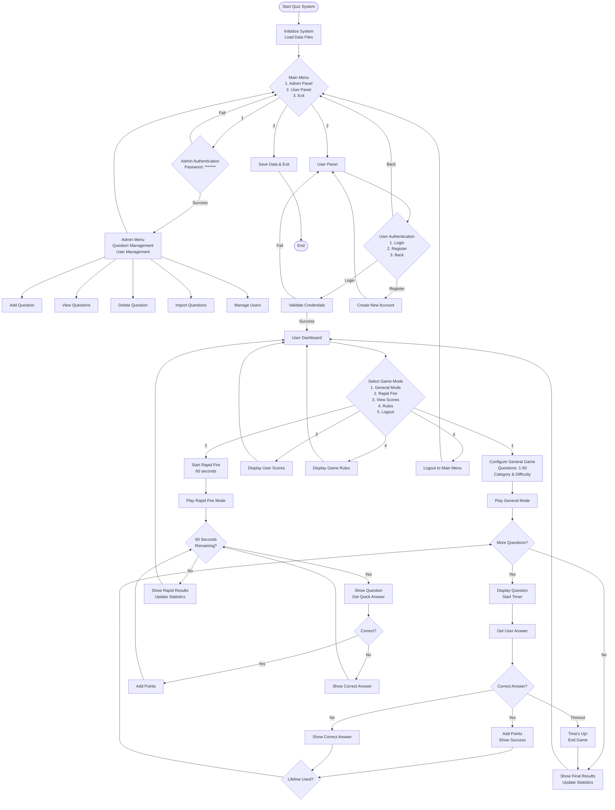
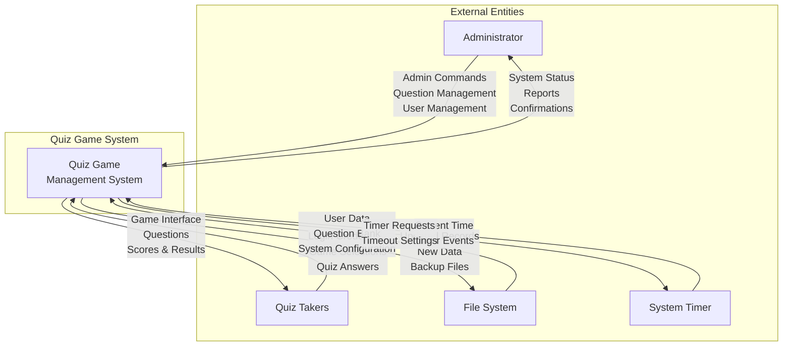
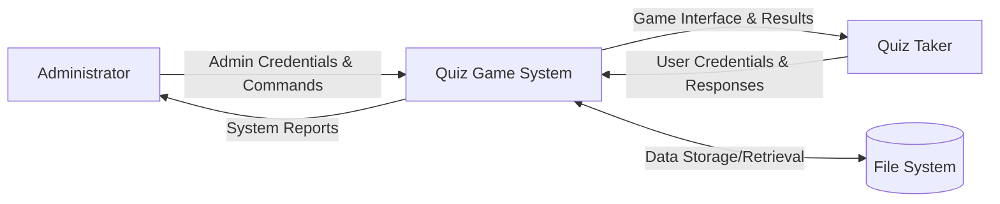
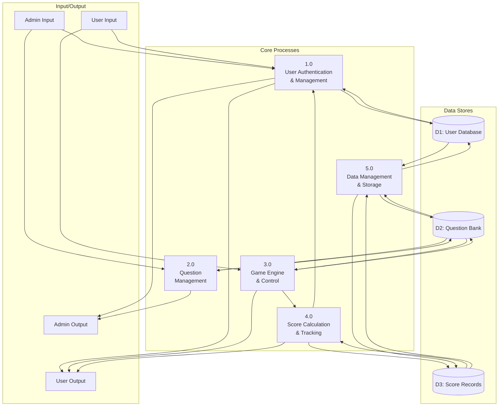
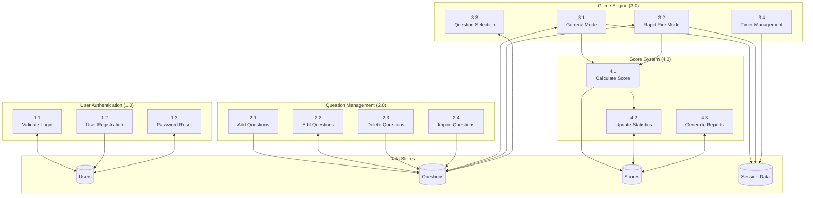

# Quiz Game System - Technical Documentation

## 7.1. Feasibility Study

### Technical Feasibility
**Status: FEASIBLE**
- **Programming Language**: C language is well-established and suitable for system-level applications
- **Development Tools**: Standard C compilers (GCC, Visual Studio) are widely available
- **Libraries**: Uses standard C libraries (stdio.h, stdlib.h, string.h, time.h)
- **Platform Compatibility**: Cross-platform compatible (Windows, Linux, macOS)
- **Memory Requirements**: Minimal memory footprint with static arrays
- **Storage Requirements**: Simple file-based storage system

### Economic Feasibility
**Status: HIGHLY FEASIBLE**
- **Development Cost**: Low (uses free development tools)
- **Maintenance Cost**: Minimal (simple architecture)
- **Hardware Requirements**: Runs on basic computer systems
- **Licensing**: No licensing fees for C development
- **Return on Investment**: Educational value and skill development

### Operational Feasibility
**Status: FEASIBLE**
- **User Interface**: Simple console-based interface, easy to learn
- **Data Management**: Straightforward file-based data storage
- **Backup & Recovery**: Simple file copy operations
- **System Requirements**: Minimal system resources needed
- **Training Requirements**: Basic computer literacy sufficient

### Schedule Feasibility
**Status: FEASIBLE**
- **Development Time**: 2-4 weeks for complete implementation
- **Testing Phase**: 1 week for comprehensive testing
- **Deployment**: Immediate (executable file)
- **Maintenance**: Ongoing minimal effort required

### Legal Feasibility
**Status: FEASIBLE**
- **No Copyright Issues**: Original code development
- **Data Privacy**: Local data storage, no external transmission
- **Educational Use**: Appropriate for academic purposes
- **Open Source Compatibility**: Can be made open source

## 7.2. Algorithm

### Complete System Algorithms

```
ALGORITHM: Quiz Game System Main Flow
BEGIN QuizGameSystem
    INITIALIZE system variables
    LOAD user data from file
    LOAD question data from file
    
    WHILE system_running DO
        DISPLAY main menu
        GET user choice
        
        SWITCH user_choice
            CASE 1: // Admin Panel
                CALL AdminAuthentication()
                IF authenticated THEN
                    CALL AdminPanel()
                END IF
                
            CASE 2: // User Panel
                CALL UserPanel()
                
            CASE 3: // Exit
                SET system_running = FALSE
                
        END SWITCH
    END WHILE
    
    SAVE all data to files
    CLEANUP and EXIT
END QuizGameSystem

ALGORITHM: Admin Authentication
BEGIN AdminAuth
    DISPLAY "Enter admin password:"
    GET admin_password
    
    IF admin_password == "******" THEN
        DISPLAY "Admin access granted"
        RETURN authentication_success
    ELSE
        DISPLAY "Invalid admin password"
        RETURN authentication_failed
    END IF
END AdminAuth

ALGORITHM: Admin Panel
BEGIN AdminPanel
    WHILE admin_session_active DO
        DISPLAY admin menu options
        GET admin_choice
        
        SWITCH admin_choice
            CASE 1: // Add Question
                CALL AddQuestion()
            CASE 2: // View Questions
                CALL ViewQuestions()
            CASE 3: // Delete Question
                CALL DeleteQuestion()
            CASE 4: // Import Questions
                CALL ImportQuestions()
            CASE 5: // View Users
                CALL ViewAllUsers()
            CASE 6: // Reset User Password
                CALL ResetUserPassword()
            CASE 7: // Delete User
                CALL DeleteUser()
            CASE 8: // Back to Main Menu
                SET admin_session_active = FALSE
        END SWITCH
    END WHILE
END AdminPanel

ALGORITHM: User Authentication
BEGIN UserAuth
    DISPLAY login/register options
    GET user choice
    
    IF choice == LOGIN THEN
        GET username, password
        SEARCH user in database
        IF found AND password_matches THEN
            RETURN user_data
        ELSE
            RETURN authentication_failed
        END IF
        
    ELSE IF choice == REGISTER THEN
        GET user details (username, password, name, email, phone)
        VALIDATE input data
        IF valid AND username_unique THEN
            CREATE new user record
            SAVE to database
            RETURN success
        ELSE
            RETURN validation_failed
        END IF
    END IF
END UserAuth

ALGORITHM: User Panel
BEGIN UserPanel
    CALL UserAuth()
    IF authentication_success THEN
        WHILE user_session_active DO
            DISPLAY user menu
            GET user_choice
            
            SWITCH user_choice
                CASE 1: // General Mode
                    CALL GeneralMode(user_data)
                CASE 2: // Rapid Fire Mode
                    CALL RapidFireMode(user_data)
                CASE 3: // View Scores
                    CALL ViewUserScores(user_data)
                CASE 4: // Game Rules
                    CALL DisplayGameRules()
                CASE 5: // Logout
                    SET user_session_active = FALSE
            END SWITCH
        END WHILE
    END IF
END UserPanel

ALGORITHM: General Game Mode
BEGIN GeneralMode(user_data)
    GET game configuration (num_questions, category, difficulty)
    INITIALIZE game variables
    SET score = 0
    SET questions_answered = 0
    SET lifeline_available = TRUE
    
    CREATE question_pool from selected category and difficulty
    SHUFFLE question_pool
    
    FOR i = 1 TO num_questions DO
        IF question_pool_empty THEN
            DISPLAY "Not enough questions available"
            BREAK
        END IF
        
        SELECT question[i] from question_pool
        DISPLAY question and options
        START timer based on difficulty
        SET answered = FALSE
        
        WHILE timer_running AND NOT answered DO
            GET user_input
            
            IF input == correct_answer THEN
                CALL CalculateScore(difficulty, time_taken, max_time)
                ADD calculated_points to score
                DISPLAY "Correct!"
                SET answered = TRUE
                
            ELSE IF input == lifeline AND lifeline_available THEN
                CALL Apply50_50Lifeline()
                SET lifeline_available = FALSE
                DISPLAY "Lifeline used - 50-50 applied"
                
            ELSE IF input == valid_option THEN
                DISPLAY "Wrong answer! Correct answer: " + correct_answer
                SET answered = TRUE
                
            ELSE IF input == quit THEN
                DISPLAY "Game ended by user"
                BREAK
            END IF
        END WHILE
        
        IF timer_expired AND NOT answered THEN
            DISPLAY "Time's up! Correct answer: " + correct_answer
        END IF
        
        INCREMENT questions_answered
        REMOVE question[i] from question_pool
    END FOR
    
    DISPLAY final results
    UPDATE user statistics
    SAVE user data
END GeneralMode

ALGORITHM: Rapid Fire Mode
BEGIN RapidFireMode(user_data)
    SET total_time = 60 seconds
    SET score = 0
    SET questions_answered = 0
    SET correct_answers = 0
    START global_timer
    
    CREATE mixed_question_pool (medium difficulty, all categories)
    SHUFFLE mixed_question_pool
    
    WHILE global_timer_running AND questions_available DO
        SELECT next_question from pool
        DISPLAY question and options
        
        GET user_answer with quick_timeout
        IF answer_correct THEN
            ADD 10 points to score
            INCREMENT correct_answers
            DISPLAY "Correct! +10 points"
        ELSE
            DISPLAY "Wrong! Answer: " + correct_answer
        END IF
        
        INCREMENT questions_answered
        REMOVE question from pool
        
        CHECK remaining time
        IF time_remaining <= 10_seconds THEN
            DISPLAY countdown timer
        END IF
    END WHILE
    
    DISPLAY rapid fire results
    DISPLAY "Questions: " + questions_answered
    DISPLAY "Correct: " + correct_answers
    DISPLAY "Score: " + score
    UPDATE user rapid fire statistics
    SAVE user data
END RapidFireMode

ALGORITHM: Question Management - Add Question
BEGIN AddQuestion
    DISPLAY "Enter question details:"
    GET question_text
    GET option1, option2, option3, option4
    GET correct_answer_number (1-4)
    GET category
    GET difficulty (1-3)
    
    VALIDATE all inputs
    IF valid THEN
        CREATE new_question record
        SET new_question.text = question_text
        SET new_question.options = [option1, option2, option3, option4]
        SET new_question.correct = correct_answer_number
        SET new_question.category = category
        SET new_question.difficulty = difficulty
        
        ADD new_question to question_database
        SAVE question_database
        DISPLAY "Question added successfully"
    ELSE
        DISPLAY "Invalid input - question not added"
    END IF
END AddQuestion

ALGORITHM: Question Management - Delete Question
BEGIN DeleteQuestion
    CALL ViewQuestions()
    DISPLAY "Enter question number to delete:"
    GET question_number
    
    IF question_number valid AND question_exists THEN
        DISPLAY question details
        DISPLAY "Confirm deletion (Y/N):"
        GET confirmation
        
        IF confirmation == 'Y' THEN
            REMOVE question from database
            SAVE question_database
            DISPLAY "Question deleted successfully"
        ELSE
            DISPLAY "Deletion cancelled"
        END IF
    ELSE
        DISPLAY "Invalid question number"
    END IF
END DeleteQuestion

ALGORITHM: Import Questions from File
BEGIN ImportQuestions
    DISPLAY "Enter filename (questions.txt):"
    GET filename
    
    OPEN file for reading
    IF file_exists THEN
        SET imported_count = 0
        WHILE NOT end_of_file DO
            READ question_line
            PARSE question components
            VALIDATE question format
            
            IF valid_format THEN
                CREATE question record
                ADD to question_database
                INCREMENT imported_count
            ELSE
                DISPLAY "Skipping invalid question: " + question_line
            END IF
        END WHILE
        
        CLOSE file
        SAVE question_database
        DISPLAY imported_count + " questions imported successfully"
    ELSE
        DISPLAY "File not found: " + filename
    END IF
END ImportQuestions

ALGORITHM: Score Calculation
BEGIN CalculateScore(difficulty, time_taken, max_time)
    SET base_points = difficulty * 10  // Easy=10, Medium=20, Hard=30
    
    IF time_taken <= max_time THEN
        SET time_ratio = (max_time - time_taken) / max_time
        SET time_bonus = time_ratio * base_points * 0.5
        SET final_score = base_points + time_bonus
    ELSE
        SET final_score = 0  // No points for timeout
    END IF
    
    IF final_score < 0 THEN
        SET final_score = 0
    END IF
    
    RETURN ROUND(final_score)
END CalculateScore

ALGORITHM: Apply 50-50 Lifeline
BEGIN Apply50_50Lifeline
    GET current_question
    GET correct_answer_index
    
    CREATE wrong_options_list
    FOR each option_index DO
        IF option_index != correct_answer_index THEN
            ADD option_index to wrong_options_list
        END IF
    END FOR
    
    RANDOMLY select 2 options from wrong_options_list
    HIDE selected wrong options
    DISPLAY remaining options (correct + 1 wrong)
END Apply50_50Lifeline

ALGORITHM: View User Scores
BEGIN ViewUserScores(user_data)
    DISPLAY "=== YOUR GAME STATISTICS ==="
    DISPLAY "General Mode High Score: " + user_data.general_high_score
    DISPLAY "Rapid Fire High Score: " + user_data.rapid_high_score
    DISPLAY "Total General Games: " + user_data.total_general_games
    DISPLAY "Total Rapid Fire Games: " + user_data.total_rapid_games
    
    IF user_data.score_count > 0 THEN
        DISPLAY "Recent Scores:"
        FOR i = 0 TO min(user_data.score_count, 10) DO
            DISPLAY (i+1) + ". " + user_data.scores[i]
        END FOR
    ELSE
        DISPLAY "No games played yet"
    END IF
    
    CALCULATE average_score
    DISPLAY "Average Score: " + average_score
END ViewUserScores

ALGORITHM: Data File Management
BEGIN SaveUserData
    OPEN users.dat for binary writing
    WRITE total_user_count
    FOR each user DO
        WRITE user_record to file
    END FOR
    CLOSE file
END SaveUserData

BEGIN LoadUserData
    IF users.dat exists THEN
        OPEN users.dat for binary reading
        READ total_user_count
        FOR i = 1 TO total_user_count DO
            READ user_record from file
            ADD user to user_database
        END FOR
        CLOSE file
    ELSE
        INITIALIZE empty user_database
    END IF
END LoadUserData
```

## 7.3. Flowchart



## 7.4. Context Diagram



## 7.5. Data Flow Diagram

### Level 0 (Context Level)


### Level 1 (Major Processes)


### Level 2 (Detailed Processes)


## 7.6. Use Case Diagram

```mermaid
graph TB
    subgraph "Quiz Game System"
        subgraph "Authentication"
            UC1[Login]
            UC2[Register]
            UC3[Reset Password]
        end
        
        subgraph "Game Play"
            UC4[Play General Mode]
            UC5[Play Rapid Fire]
            UC6[Use Lifeline]
            UC7[View Game Rules]
        end
        
        subgraph "User Management"
            UC8[View Personal Scores]
            UC9[Update Profile]
            UC10[Logout]
        end
        
        subgraph "Admin Functions"
            UC11[Add Question]
            UC12[Edit Question]
            UC13[Delete Question]
            UC14[Import Questions]
            UC15[View All Users]
            UC16[Delete User]
            UC17[Reset User Password]
            UC18[View System Reports]
        end
        
        subgraph "System Functions"
            UC19[Save Game Data]
            UC20[Load System Data]
            UC21[Backup Data]
        end
    end
    
    subgraph "Actors"
        ADMIN[Administrator]
        USER[Quiz Taker]
        GUEST[Guest User]
        SYSTEM[System Timer]
    end
    
    %% Guest User Associations
    GUEST --> UC2
    
    %% Quiz Taker Associations
    USER --> UC1
    USER --> UC4
    USER --> UC5
    USER --> UC6
    USER --> UC7
    USER --> UC8
    USER --> UC9
    USER --> UC10
    
    %% Administrator Associations
    ADMIN --> UC1
    ADMIN --> UC11
    ADMIN --> UC12
    ADMIN --> UC13
    ADMIN --> UC14
    ADMIN --> UC15
    ADMIN --> UC16
    ADMIN --> UC17
    ADMIN --> UC18
    
    %% System Associations
    SYSTEM --> UC19
    SYSTEM --> UC20
    SYSTEM --> UC21
    
    %% Include Relationships
    UC4 -.->|includes| UC19
    UC5 -.->|includes| UC19
    UC1 -.->|includes| UC20
    UC11 -.->|includes| UC19
    UC12 -.->|includes| UC19
    UC13 -.->|includes| UC19
    UC14 -.->|includes| UC19
    
    %% Extend Relationships
    UC6 -.->|extends| UC4
    UC3 -.->|extends| UC1
```



### Use Case Descriptions

#### Primary Use Cases

**UC1: Login**
- **Actor**: Quiz Taker, Administrator
- **Description**: User provides credentials to access the system
- **Precondition**: User has valid account
- **Postcondition**: User is authenticated and logged in

**UC4: Play General Mode**
- **Actor**: Quiz Taker
- **Description**: User configures and plays customizable quiz game
- **Precondition**: User is logged in
- **Postcondition**: Game results are saved to user profile

**UC5: Play Rapid Fire**
- **Actor**: Quiz Taker
- **Description**: User plays 60-second rapid-fire quiz
- **Precondition**: User is logged in
- **Postcondition**: Rapid fire score is recorded

**UC11: Add Question**
- **Actor**: Administrator
- **Description**: Admin adds new questions to the question bank
- **Precondition**: Admin is authenticated
- **Postcondition**: New question is stored in database

#### Secondary Use Cases

**UC6: Use Lifeline**
- **Actor**: Quiz Taker
- **Description**: User uses 50-50 lifeline during general mode
- **Precondition**: Playing general mode, lifeline available
- **Postcondition**: Two wrong options are eliminated

**UC14: Import Questions**
- **Actor**: Administrator
- **Description**: Admin imports questions from text file
- **Precondition**: Valid text file with proper format
- **Postcondition**: Questions are added to database

**UC18: View System Reports**
- **Actor**: Administrator
- **Description**: Admin views system statistics and user data
- **Precondition**: Admin is authenticated
- **Postcondition**: Reports are displayed